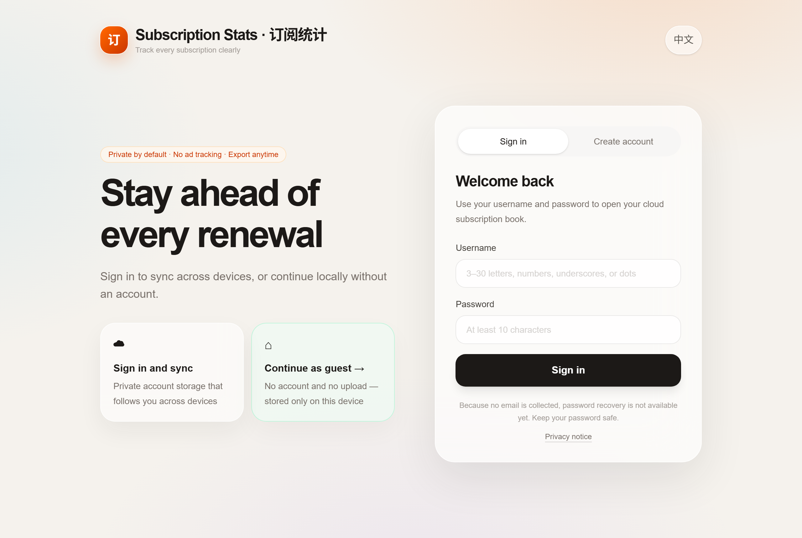

# Subscription Stats · 订阅统计

[](README.en.md) [](README.md) 

**In one sentence: remember when every subscription renews and how much it really costs per year — especially handy when you share plans with friends.**

**Try it now**: [subscription-stats.1290875146ennheng.workers.dev](https://subscription-stats.1290875146ennheng.workers.dev) (guest mode, no sign-up) · **Android APK**: [download from Releases](https://github.com/ennheng/subscription-stats/releases/latest)



## What problem it solves

- Subscriptions pile up and **you lose track of renewal dates** — the charge notification is your reminder
- When **sharing plans** like Netflix or iCloud+ with friends, the total price, everyone's share, and the plan owner get buried in chat history
- At the end of the month you have **no idea how much you spend on subscriptions per year**

For each subscription, record *your share, the billing cycle, and the next due date*, and it will:

- Compute your **monthly average** and **annual total** with a spending breakdown chart
- Warn you 7 days before a renewal and highlight overdue ones; tap **"Mark paid"** and the date rolls forward to the next period
- Export an **ICS calendar file** so renewals show up in your system calendar (next 8 occurrences per subscription)
- Export a **JSON** backup of everything

## Three ways to use it

| Mode | Account needed | Where data lives | Best for |
|---|:---:|---|---|
| **Web guest mode** | No | Current browser only | Trying it out, no sign-up |
| **Web account mode** | Username + password (no email) | Cloud sync | Multiple devices |
| **Android offline APK** | No account feature | Phone local storage | Privacy-first, fully offline |

Notes:

- The web app is an **installable PWA** — guest mode **works offline** once installed
- The Android build is a separate tiny app that **requests no network permission**; data never leaves the phone
- The three modes don't share data: guest data is never uploaded, and clearing browser data or uninstalling the app erases local records
- No email means **no password recovery** — keep your password safe; you can permanently delete the account and its data with your password

## Want to hack on it? Fork away

### What to install

| Required? | Software | Why |
|---|---|---|
| Required | **Node.js 22.13+** (npm included) | Run the web app |
| Optional | **JDK 17 + Android SDK** | Only for the Android shell |
| Optional | A Cloudflare account | Only for deploying your own instance |

### Five steps to run it

```bash
# 1. Fork this repo, then clone your fork
git clone https://github.com/<you>/subscription-stats.git
cd subscription-stats

# 2. Install dependencies
npm install

# 3. Local config (set BETTER_AUTH_SECRET to a random 32+ character string)
cp .dev.vars.example .dev.vars        # Windows PowerShell: Copy-Item .dev.vars.example .dev.vars

# 4. Initialize the local database
npm run db:migrate:local

# 5. Start the dev server
npm run dev
```

Open the URL printed in your terminal (usually `http://localhost:3000`).

### Verify your changes

```bash
npm run lint     # lint
npm test         # build + 4 end-to-end tests (account isolation, validation, ICS/JSON export, PWA)
```

### Code map: where things live

| What you want to change | Where to go |
|---|---|
| Money/cycle/date calculations | `lib/subscriptions.ts` (pure functions shared by all ends) |
| Service presets (Netflix, iCloud+…) | `lib/presets.ts` |
| Chinese/English copy | `lib/i18n.ts` |
| Pages and API routes | `app/` (Next.js App Router) |
| Guest mode (browser storage) | `lib/guest-subscriptions.ts` |
| Database schema | `db/schema.ts`, migrations in `drizzle/` |
| Android offline shell | `android-offline/` (standalone native WebView app with its own embedded HTML/JS) |
| End-to-end tests | `tests/rendered-html.test.mjs` |

### Build the Android app

```bash
cd android-offline
./gradlew assembleDebug lintDebug     # Windows: .\gradlew.bat assembleDebug lintDebug
```

The APK lands at `android-offline/app/build/outputs/apk/debug/subscription-stats-v0.1.0-debug.apk` — the file name carries the version number.

For distribution, build a signed release APK (requires your own signing key):

```bash
# 1. Create a signing key (once; back it up — losing it means you can never update the app)
keytool -genkey -v -keystore subscription-stats.keystore -alias subscription-stats -keyalg RSA -keysize 2048 -validity 10000

# 2. Create keystore.properties in android-offline/ (git-ignored, never committed):
#    storeFile=subscription-stats.keystore
#    storePassword=your-store-password
#    keyAlias=subscription-stats
#    keyPassword=your-key-password

# 3. Build
./gradlew assembleRelease
```

Output: `android-offline/app/build/outputs/apk/release/subscription-stats-v0.1.0-release.apk`. Without `keystore.properties` the release build still succeeds, but the APK is **unsigned** and phones will refuse to install it.

### Deploy your own instance (optional)

The cloud mode runs on Cloudflare Workers + D1; the free tier is plenty for personal use. Roughly: create your own D1 database → point `database_name` / `database_id` in `wrangler.jsonc` at it → apply migrations with `npm run db:migrate:remote` → set a production `BETTER_AUTH_SECRET` → deploy like any Cloudflare Worker. If you only hack locally or build the APK, you don't need any of this.

## Privacy

- Guest mode and the Android APK: data **never leaves your device**
- Cloud accounts are strictly isolated by user ID — cross-account access always looks like "not found" (covered by end-to-end tests)
- Passwords are stored hashed; no email is collected
- Export everything (JSON) or delete your account at any time

## Tech stack

Web: vinext / Next.js 16 / React 19 / Tailwind CSS 4 · Cloudflare Workers + D1 / Drizzle ORM / Better Auth
Android: native WebView shell with fully embedded HTML/CSS/JS (nothing loaded remotely)

## License

No open-source license has been chosen yet. Public visibility does not grant reuse rights — please open an issue before building on it.
