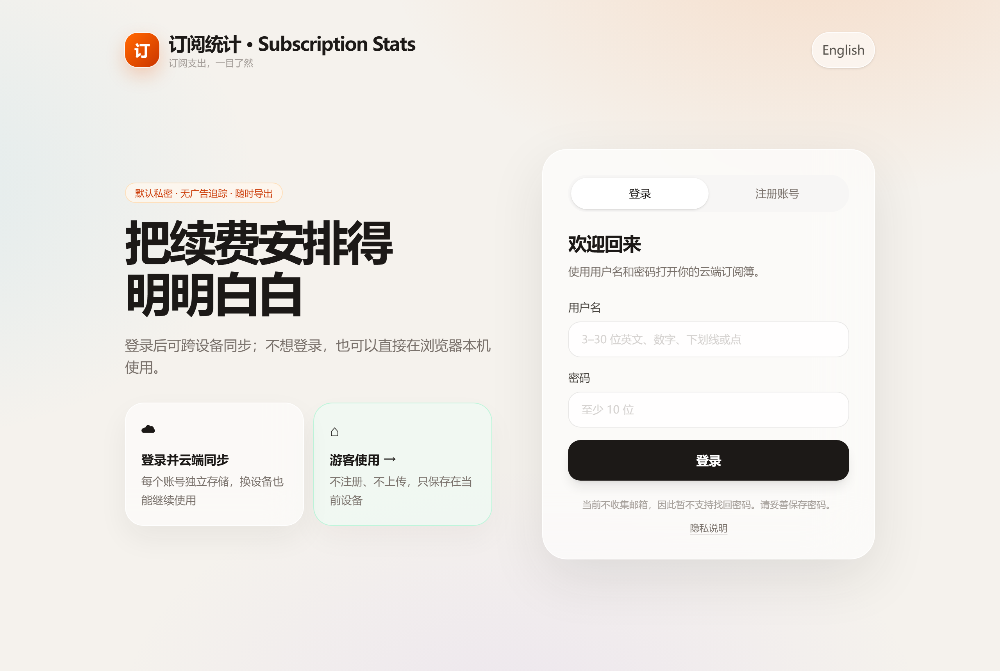
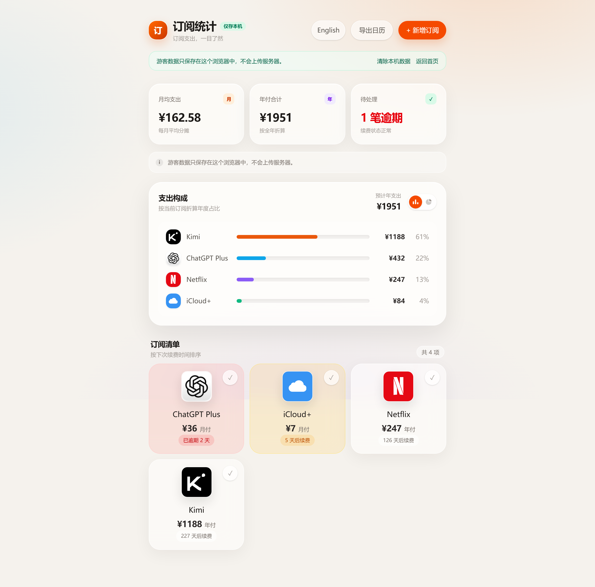

# 订阅统计 · Subscription Stats

[](README.md) [](README.en.md) 

**一句话:帮你记住每个订阅什么时候扣钱、一年到底花了多少钱——尤其适合合租/拼车分摊的场景。**

**在线体验**:[subscription-stats.1290875146ennheng.workers.dev](https://subscription-stats.1290875146ennheng.workers.dev)(打开即用,游客模式免注册) · **Android APK**:[Releases 页面下载](https://github.com/ennheng/subscription-stats/releases/latest)



## 它解决什么问题

- 订阅越开越多,**记不清哪天续费**,总是收到扣款短信才想起来
- 和朋友合租 Netflix、iCloud+ 这类账号,**总价、每人份额、谁的车**散落在聊天记录里
- 月底想复盘,**不知道自己一年在订阅上花了多少钱**

把每项订阅的「我的份额、付款周期、下次到期日」记进去,它会自动帮你:

- 算出**月均支出**和**年付合计**,附支出构成图表
- 到期前 7 天提醒,逾期标红;付完款点一下「标记已付」,日期自动顺延到下一期
- 导出 **ICS 日历文件**,续费日期直接出现在手机/电脑的系统日历里(每项订阅未来 8 期)
- 导出 **JSON** 备份全部数据



## 三种用法,按需要选

| 用法 | 要注册吗 | 数据存在哪 | 适合谁 |
|---|:---:|---|---|
| **网页游客模式** | 不用 | 只存当前浏览器 | 先试试、不想注册 |
| **网页账号模式** | 用户名+密码(不收邮箱) | 云端同步 | 多设备切换 |
| **Android 离线 APK** | 没有账号功能 | 只存手机本地 | 重视隐私、完全离线 |

几点说明:

- 网页版支持**安装成 PWA**(加到手机主屏幕/电脑桌面),游客模式装好后**断网也能用**
- Android 版是独立的小 App,**不申请网络权限**,数据永远不出手机
- 三种用法的数据互不相通:游客数据不会上传,清浏览器数据或卸载 App 会删掉本机记录
- 注册不需要邮箱,所以**没有找回密码功能**,请保管好密码;账号菜单里可凭密码彻底删除账号和数据

## 想自己改?Fork 一份就能动手

### 需要安装的东西

| 必装/选装 | 软件 | 用途 |
|---|---|---|
| 必装 | **Node.js 22.13+**(自带 npm) | 跑网页版 |
| 选装 | **JDK 17 + Android SDK** | 只有要改 Android 壳才需要 |
| 选装 | Cloudflare 账号 | 只有要部署自己的线上实例才需要 |

### 五步跑起来

```bash
# 1. Fork 本仓库后,克隆你自己的那份
git clone https://github.com/<你的用户名>/subscription-stats.git
cd subscription-stats

# 2. 安装依赖
npm install

# 3. 准备本地配置(把 BETTER_AUTH_SECRET 改成至少 32 位随机字符串)
cp .dev.vars.example .dev.vars        # Windows PowerShell: Copy-Item .dev.vars.example .dev.vars

# 4. 初始化本地数据库
npm run db:migrate:local

# 5. 启动
npm run dev
```

打开终端里显示的地址(通常是 `http://localhost:3000`)就能看到页面。

### 改完怎么验证

```bash
npm run lint     # 代码检查
npm test         # 构建 + 4 个端到端测试(账号隔离、表单校验、ICS/JSON 导出、PWA)
```

### 代码地图:想改的功能在哪

| 想改什么 | 去哪里 |
|---|---|
| 金额/周期/日期的计算逻辑 | `lib/subscriptions.ts`(纯函数,三端共用) |
| 服务预设( Netflix、iCloud+ 那些) | `lib/presets.ts` |
| 中文/英文文案 | `lib/i18n.ts` |
| 页面和 API | `app/`(Next.js App Router) |
| 游客模式(浏览器存储) | `lib/guest-subscriptions.ts` |
| 数据库表结构 | `db/schema.ts`,迁移在 `drizzle/` |
| Android 离线壳 | `android-offline/`(独立的原生 WebView 工程,内嵌自己的 HTML/JS,与网页代码分开) |
| 端到端测试 | `tests/rendered-html.test.mjs` |

### 改 Android 版

```bash
cd android-offline
./gradlew assembleDebug lintDebug     # Windows: .\gradlew.bat assembleDebug lintDebug
```

APK 生成在 `android-offline/app/build/outputs/apk/debug/subscription-stats-v0.1.0-debug.apk`,文件名自带版本号。

正式发布请打 release 包(需要自己的签名密钥):

```bash
# 1. 生成签名密钥(只需一次;务必备份,丢了就无法再更新同一个 App)
keytool -genkey -v -keystore subscription-stats.keystore -alias subscription-stats -keyalg RSA -keysize 2048 -validity 10000

# 2. 在 android-offline/ 下新建 keystore.properties(已被 .gitignore 忽略,不会提交):
#    storeFile=subscription-stats.keystore
#    storePassword=你的密钥库密码
#    keyAlias=subscription-stats
#    keyPassword=你的密钥密码

# 3. 构建
./gradlew assembleRelease
```

产物在 `android-offline/app/build/outputs/apk/release/subscription-stats-v0.1.0-release.apk`。没有 `keystore.properties` 时也能构建,但得到的是**未签名**包,手机会拒绝安装。

### 想部署自己的线上实例(可选)

云端模式跑在 Cloudflare Workers + D1 上,免费额度足够个人使用。大致步骤:创建自己的 D1 数据库 → 把 `wrangler.jsonc` 里的 `database_name` / `database_id` 换成你的 → `npm run db:migrate:remote` 应用迁移 → 配置生产环境 `BETTER_AUTH_SECRET` → 按 Cloudflare Workers 的方式部署。只在本地折腾或只打 APK 的话,完全不用碰这些。

## 隐私

- 游客模式和 Android APK 的数据**不离开设备**
- 云端账号按用户 ID 严格隔离,跨账号访问一律返回"不存在"(有端到端测试兜底)
- 密码经哈希存储,不存明文;不收集邮箱
- 随时可以导出全部数据(JSON)或删除账号

## 技术栈

网页端:vinext / Next.js 16 / React 19 / Tailwind CSS 4 · Cloudflare Workers + D1 / Drizzle ORM / Better Auth
Android:原生 WebView 壳 + 完全内嵌的 HTML/CSS/JS(无任何远程加载)

## License

暂未选择开源许可证。仓库公开不代表授权复用;如果你想基于它做二次开发,请先开个 Issue 聊聊。
